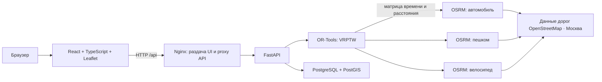

# Waypoint

**Панель диспетчера выездных инженеров:** загрузка заявок, назначение специалистов, расчёт маршрутов по Москве и перепланирование рабочего дня.

Полная документация проекта находится в этом файле: [README в репозитории](https://github.com/kaiL163/Waypoint/blob/main/README.md). Здесь описаны архитектура, технологии, локальный запуск, Docker-развёртывание, API, данные, алгоритм и известные ограничения.

## Быстрый запуск

### Требования

- Windows 10/11, macOS или Linux.
- Docker Desktop с Linux containers либо Docker Engine + Compose plugin.
- Интернет при первом запуске: загружаются контейнеры, карта Москвы и тайлы OSM.
- Для загрузки и подготовки дорожной карты выделите Docker около 6–8 ГБ памяти и несколько гигабайт свободного диска.

### Запустить весь проект

Откройте PowerShell в корне репозитория:

```powershell
docker compose up -d --build
```

Откройте [http://localhost:5173](http://localhost:5173). API и его интерактивная документация доступны по адресу [http://localhost:5173/docs](http://localhost:5173/docs).

Первый запуск может занять несколько минут: Compose загружает файл дорог Москвы (~81 МБ) и строит отдельные дорожные графы для автомобиля, пешехода и велосипеда. Посмотреть ход подготовки:

```powershell
docker compose ps
docker compose logs -f osrm-prepare
```

Когда подготовка завершится, Compose автоматически запустит API и сайт. На следующих запусках готовые графы и данные останутся в Docker volumes.

### Если порт 5173 уже занят

В той же PowerShell-сессии укажите другой порт до запуска Compose:

```powershell
$env:WAYPOINT_PORT = '5180'
docker compose up -d --build
```

Тогда откройте [http://localhost:5180](http://localhost:5180). Это значение действует только в текущем окне PowerShell. Для постоянной настройки задайте `WAYPOINT_PORT=5180` в корневом файле `.env`.

### Остановка и повторный запуск

```powershell
docker compose stop       # остановить, сохранив базу и графы
docker compose start      # продолжить работу
docker compose down       # удалить контейнеры и сеть, сохранив volumes
```

Команда `docker compose down -v` удаляет базу данных и дорожные графы. Используйте её только когда намеренно хотите очистить сохранённые данные и готовы повторно скачивать карту.

## Запуск frontend в режиме разработки

Удобно, если PostgreSQL, API и OSRM уже работают через Compose, а React нужно запускать отдельно с горячей перезагрузкой.

В одном PowerShell запустите инфраструктуру и production-сайт на другом порту:

```powershell
$env:WAYPOINT_PORT = '5180'
docker compose up -d --build
```

Создайте файл `frontend/.env.local` со строкой:

```env
VITE_API_BASE_URL=http://localhost:5180
```

В другом PowerShell:

```powershell
cd frontend
npm ci
npm run dev
```

Откройте [http://localhost:5173](http://localhost:5173). Vite использует API через контейнерный frontend на порту 5180; запросы с dev-сервера разрешены текущей локальной CORS-настройкой backend.

Чтобы вернуться к сборке frontend в Docker, остановите Vite сочетанием `Ctrl+C` и откройте [http://localhost:5180](http://localhost:5180).

## Архитектура



- **Frontend:** React, TypeScript, Vite, Leaflet и React-Leaflet. Панель инженеров и таблица заявок, карта, фильтры, маршруты, карточки подробностей, сравнение и мобильная навигация.
- **Nginx:** обслуживает production-сборку frontend, проксирует API и Swagger на тот же origin.
- **Backend:** Python 3.11, FastAPI, Pydantic 2. Проверка данных, импорт JSON/CSV, события рабочего дня, сравнение планов и объяснение результата.
- **Планировщик:** Google OR-Tools, VRPTW (маршрутизация с временными окнами). Для каждого транспорта передаются собственные времена и расстояния между точками.
- **Маршрутизация:** три локальных OSRM-сервиса и три графа из одного московского OSM-экстракта. Авто использует профиль дорожной сети для машин, walking — пешеходный профиль, bicycle — велосипедный. Профиль разрешённых OSM-путей сам по себе не гарантирует выделенный тротуар на всём пути.
- **Хранение:** PostgreSQL 16 + PostGIS 3. Текущий набор, план, базовый план и снимки версий хранятся в PostgreSQL. Точки инженеров и заявок хранятся в PostGIS как геометрия EPSG:4326 с пространственным индексом. Проверка revision защищает от случайной записи поверх более свежего состояния.
- **Docker Compose:** запускает базу, скачивание и подготовку графов, OSRM-сервисы, backend и frontend с nginx.

В базе создаются таблицы `waypoint_state_v2`, `waypoint_history_v2` и `waypoint_locations_v2`. Другие таблицы не очищаются. Набор данных старых реализаций Waypoint автоматически не мигрируется. История снимков записывается, интерфейс её просмотра и восстановления пока не предоставляет.

## Конфигурация

Необязательные настройки находятся в [`.env.example`](.env.example). Чтобы переопределить их, создайте корневой файл `.env`:

```env
POSTGRES_PASSWORD=задайте_собственный_пароль
WAYPOINT_PORT=5173
MAX_SOLVE_SECONDS=10
OSM_PBF_URL=https://download.bbbike.org/osm/bbbike/Moscow/Moscow.osm.pbf
```

| Переменная | Назначение | Значение по умолчанию |
|---|---|---|
| `POSTGRES_PASSWORD` | Пароль PostgreSQL, передаваемый сервису backend | `waypoint_dev_password` |
| `WAYPOINT_PORT` | Порт сайта на компьютере | `5173` |
| `MAX_SOLVE_SECONDS` | Верхний предел времени поиска OR-Tools | `10` секунд |
| `OSM_PBF_URL` | URL файла дорог для построения графов OSRM | Карта Москвы BBBike |

Для локальной демонстрации Compose публикует frontend только на `127.0.0.1`; PostgreSQL и OSRM остаются внутри сети Docker. Авторизации нет. Перед размещением в общей сети или интернете добавьте вход пользователей, HTTPS, сетевые ограничения и резервное копирование.

Если меняете пароль после первого запуска, одного изменения `.env` недостаточно: уже созданный volume PostgreSQL хранит пароль, установленный при первичной инициализации базы. Также не размещайте `.env` с реальным паролем в репозитории.

## API

Полная интерактивная спецификация OpenAPI доступна в Swagger:

- Docker по умолчанию: [http://localhost:5173/docs](http://localhost:5173/docs)
- Если задан `WAYPOINT_PORT=5180`: [http://localhost:5180/docs](http://localhost:5180/docs)
- Файл OpenAPI: `/openapi.json` на том же адресе.

API использует JSON и работает через frontend origin; backend отдельно не опубликован на host-порт. Основные маршруты:

| Метод | Путь | Назначение |
|---|---|---|
| GET | `/api/health` | Проверка доступности backend и соединения с БД |
| GET | `/api/state` | Текущий набор, план, baseline и revision |
| GET | `/api/engineers` | Инженеры текущего набора |
| GET | `/api/requests` | Заявки текущего набора |
| GET | `/api/planning/current` | Последний план; 404, если плана ещё нет |
| POST | `/api/planning/compare` | Рассчитать baseline и оптимизированный план, сохранить оба |
| POST | `/api/planning/optimize?strategy=baseline` | Рассчитать baseline без изменения БД |
| POST | `/api/planning/optimize?strategy=optimized` | Рассчитать и сохранить оптимизированный план |
| POST | `/api/planning/replan` | Применить событие ко времени события и перепланировать остаток дня |
| GET | `/api/data/demos` | Список пяти демонстрационных сценариев |
| POST | `/api/data/demo?scenario=large` | Загрузить выбранное демо в активное состояние |
| POST | `/api/data/upload` | Загрузить от одного до десяти файлов JSON/CSV как multipart/form-data |

Пример: запросить состояние и загрузить большое демо из PowerShell:

```powershell
$state = Invoke-RestMethod 'http://localhost:5173/api/state'
$demo = Invoke-RestMethod -Method Post 'http://localhost:5173/api/data/demo?scenario=large'
$demo.engineers.Count
$demo.requests.Count
```

Построить план для загруженного набора можно кнопкой «Построить план» в интерфейсе. Программный клиент отправляет весь объект `Dataset` в `POST /api/planning/compare`. Метод сохраняет результат и возвращает поля `dataset`, `plan`, `baseline`, `changes`.

Перепланирование принимает объект вида:

```json
{
  "dataset": {
    "engineers": [],
    "requests": [],
    "revision": 1
  },
  "event": {
    "type": "urgent_request",
    "eventTime": "12:00",
    "input": {
      "address": "Москва, ул. Тверская, 1",
      "lat": 55.76,
      "lng": 37.61,
      "eventTime": "12:00",
      "windowStart": "12:30",
      "windowEnd": "16:00",
      "durationMinutes": 45,
      "requiredSkill": "Аварийные работы",
      "requiredTransport": "car"
    }
  }
}
```

У события тип `urgent_request`, `cancel_request` или `engineer_unavailable`; `eventTime` обязателен во всех случаях. Для отмены передайте `requestId`, для недоступного инженера — `engineerId`. Сервер использует актуальный сохранённый план. Устаревшая версия набора даёт HTTP 409; неверные поля — HTTP 422; отмена уже начатой поездки/работы — HTTP 409.

Демо и загрузка заменяют **единственный текущий набор данных**, это отражается в новой версии и истории базы. Если с приложением работают несколько человек, учитывайте, что их данные и план обрабатываются в одном общем состоянии.

## Формат данных и импорт

Основной JSON имеет поля `engineers` и `requests`. Пример полного набора: [backend/samples/demo-standard.json](backend/samples/demo-standard.json). Есть также CSV-пример: [frontend/public/samples/demo-standard.csv](frontend/public/samples/demo-standard.csv).

Структура инженера:

```json
{
  "id": "eng-1",
  "name": "Иван Иванов",
  "startLocation": {"lat": 55.7512, "lng": 37.6001},
  "shiftStart": "09:00",
  "shiftEnd": "18:00",
  "skills": ["Локальные работы", "Аварийные работы"],
  "transport": "car",
  "available": true
}
```

Структура заявки:

```json
{
  "id": "req-1",
  "location": {
    "address": "Москва, Новый Арбат, 11",
    "lat": 55.7529,
    "lng": 37.5992
  },
  "durationMinutes": 35,
  "windowStart": "09:00",
  "windowEnd": "12:00",
  "requiredSkill": "Локальные работы",
  "priority": "normal",
  "requiredTransport": "car"
}
```

`requiredTransport` необязателен; `priority` — `normal` или `urgent`. Статус отменённой заявки можно передать как `"status": "cancelled"`. Времена указываются в формате `HH:MM` в пределах одного дня.

CSV инженеров можно передать отдельным файлом, в названии которого есть `engineer` или `инженер`. Колонки: `id,name,lat,lng,shiftStart,shiftEnd,skills,transport,available`. Навыки разделяются точкой с запятой или `|`.

CSV заявок передаётся отдельным файлом с `request` или `заявк` в названии. Колонки: `id,address,lat,lng,durationMinutes,windowStart,windowEnd,requiredSkill,priority,requiredTransport`. Также поддерживается один CSV с колонкой `entity` и значениями `engineer` / `request`. Допустимые кодировки: UTF-8, UTF-8 BOM, UTF-16, Windows-1251.

Для CSV, выгруженного из таблиц Билайн, поддерживаются поля «Заявка», «Тип заявки HD» или «Тип заявки BK», «Адрес» (либо «Район»), «Начало», «Окончание», «Бригада». Справочник сопоставляет описание типа заявки с нормативом. Время технической работы и документов входит в `durationMinutes`; справочное время дороги не прибавляется второй раз. Неизвестный тип использует локальный норматив. Проверьте соответствия требованиям своей бригады до реального планирования.

Если у заявки нет координат, импорт подставляет приблизительную точку по локальному справочнику/эвристике и помечает её как оценочную. Сетевой геокодер не используется. Если инженеры генерируются из CSV Билайн, стартовые точки, смены, навыки и транспорт тоже являются предположениями. UI показывает предупреждения: для рабочего использования укажите реальные координаты и данные сотрудников.

Лимит прототипа: до 30 инженеров и 300 заявок; не более 10 файлов за одну загрузку, каждый до 10 МБ. Все ID внутри списка уникальны. Продолжительность — целые минуты от 1 до 1440. Координаты должны быть конечными и лежать в пределах допустимых широт и долгот.

## Логика планирования

1. **Временное окно ограничивает начало работ.** Начало должно быть между `windowStart` и `windowEnd` включительно. Работа может закончиться позже конца окна, но обязана закончиться до конца смены.
2. Маршрут учитывает рабочие часы, навыки инженера, необходимый вид транспорта и время переезда. Одновременно выполнять две работы невозможно.
3. **Baseline** проходит заявки строго в исходном порядке и назначает заявку первому допустимому инженеру во входном порядке. Это простой последовательный ориентир, а не глобальная оптимизация.
4. **OR-Tools** в первую очередь старается не потерять срочные заявки, затем увеличивает общее число назначенных заявок, сокращает количество задействованных инженеров и пробег. Если найденное решение хуже baseline по этим целям, возвращается baseline.
5. Поиск ограничен `MAX_SOLVE_SECONDS` (до 10 секунд по умолчанию и меньше для небольших наборов). Это эвристический поиск допустимого плана, а не доказательство математического оптимума.
6. В маршруте нет обязательного возвращения на стартовую точку после последнего клиента.
7. При перепланировании новая заявка не начинается раньше времени события. Инженер считается выезжающим сразу после конца предыдущей работы или начала смены. Начатая к моменту события поездка, ожидание на адресе и выполняемая работа фиксируются; отменить уже начатую заявку нельзя. Недоступный инженер завершает текущую зафиксированную часть, но новые заявки не получает. GPS и фактическое подтверждение начала/завершения пока не подключены.
8. Назначения содержат объяснение с навыком, транспортом, переездом, временным окном и концом смены. Для заявки без назначения выводится причина, а для конфликтного случая отмечается, если поиск не доказывает отсутствие любого допустимого решения.

## Маршрутизация и известные ограничения

- OSRM считает время, расстояния и дорожную геометрию для автомобилей, пешеходов и велосипедов по своим профилям OpenStreetMap. Живые пробки, перекрытия и расписания не учитываются.
- Пешеходный профиль выбирает разрешённую для ходьбы сеть OpenStreetMap, но отдельный тротуар вдоль каждого отрезка не гарантируется.
- Общественный транспорт пока приблизительный: расстояние по прямой с коэффициентом 1,3 и средняя скорость 18 км/ч, без остановок, расписаний и пересадок. На карте линия показана пунктиром. Реальные transit-маршруты требуют данных GTFS и специализированного маршрутизатора.
- Если координату невозможно привязать к дорожному графу или OSRM не отвечает, API сообщает об ошибке. Скрытого переключения на расчёт по прямой нет.
- `ROUTING_MODE=estimate` служит только для тестов и намеренно приблизительных расчётов; Compose его не включает.
- Для карты нужна сеть: она использует подложку OpenStreetMap. Атрибуция © OpenStreetMap contributors остаётся в интерфейсе.

## Проверка проекта

Frontend production-сборка:

```powershell
npm run build --prefix frontend
```

Backend unit/API-тесты (estimate включается внутри тестового процесса; пользовательская PostgreSQL не меняется):

```powershell
docker compose exec backend python -m unittest discover -s tests -v
```

Read-only smoke-проверка живых OSRM и PostGIS, без перезаписи активного набора:

```powershell
docker compose exec backend python tests/check_stack.py
```

Проверка итоговой конфигурации Compose:

```powershell
docker compose config --quiet
```

Сценарии интерфейса для демо на 5–7 минут:

1. **Демо 1 · Рабочий день:** постройте план, выберите инженера и откройте маршрут/карточку заявки.
2. **Сравнение планов:** сравните назначенные заявки, число инженеров, пробег и разбивку по инженерам.
3. **Демо 2 · Конфликты:** откройте неназначенную заявку, проверьте конкретную причину.
4. **Демо 4 · Перепланирование:** постройте план, добавьте срочную заявку с временем события; затем отмените будущую заявку или отметьте инженера недоступным. Проверьте зафиксированную часть и журнал изменений.
5. **Демо 5 · Большая смена:** 12 инженеров и 72 заявки; попробуйте сортировку по заголовкам, поиск, фильтры и карту с кластерами.
6. Обновите страницу: активный набор и план восстанавливаются из PostgreSQL.

Последняя локально зафиксированная проверка для синтетического Демо 5 дала следующий результат. Это замер одного запуска, не обещание такого же эффекта на других данных:

| Метрика | Baseline | OR-Tools |
|---|---:|---:|
| Заявки назначены | 64 из 72 | 72 из 72 |
| Задействованные инженеры | 12 | 7 |
| Общий пробег | 247,03 км | 76,99 км |

Проверены тесты временного окна, конца смены, приоритета срочных, совместимости навыка/транспорта, событий, сохранения начатой части, конфликта версий и набора на 72 заявки. UI проверен на 390 px и широких desktop-размерах; список заявок прокручивается внутри панели с закреплённой шапкой.

## Полезные ссылки

- [Swagger / OpenAPI](http://localhost:5173/docs) — доступен, когда проект запущен.
- [OpenAPI JSON](http://localhost:5173/openapi.json) — схема API.
- [Исходный код Waypoint на GitHub](https://github.com/kaiL163/Waypoint).
- [Google OR-Tools: VRPTW](https://developers.google.com/optimization/routing/vrptw).
- [Google OR-Tools: штрафы за неназначенные заявки](https://developers.google.com/optimization/routing/penalties).
- [OSRM HTTP API](https://project-osrm.org/docs/v5.24.0/api/).
- [Атрибуция OpenStreetMap](https://www.openstreetmap.org/copyright).
